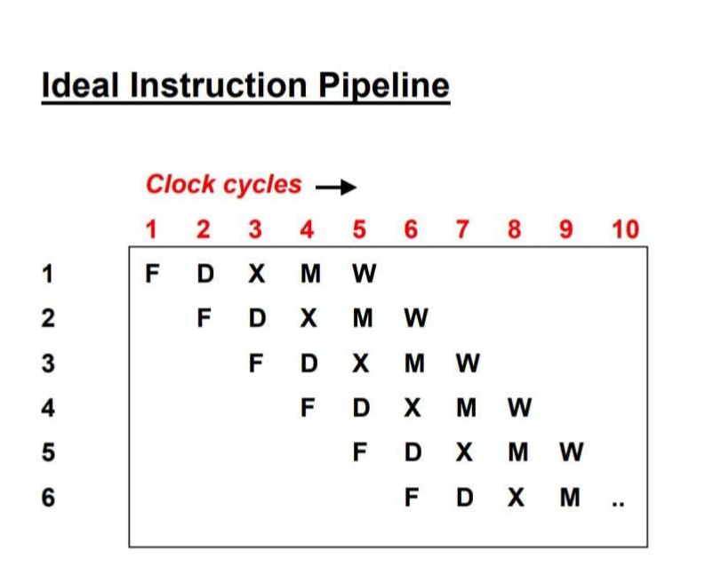
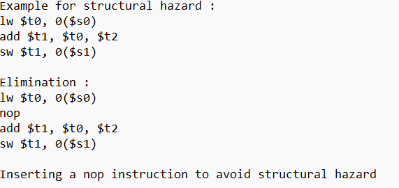
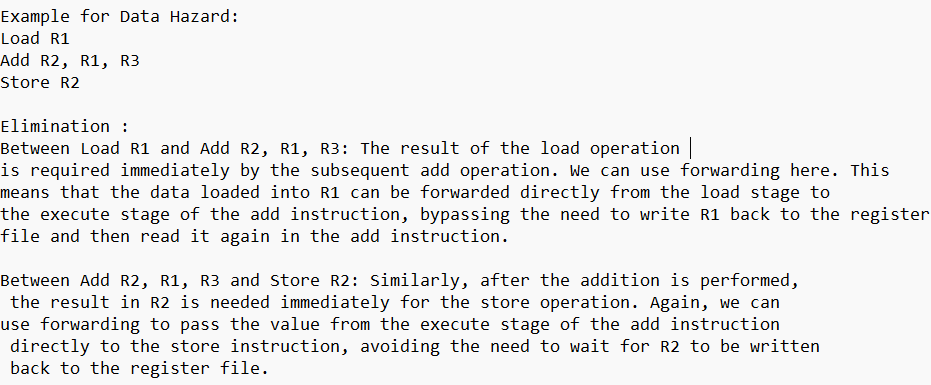
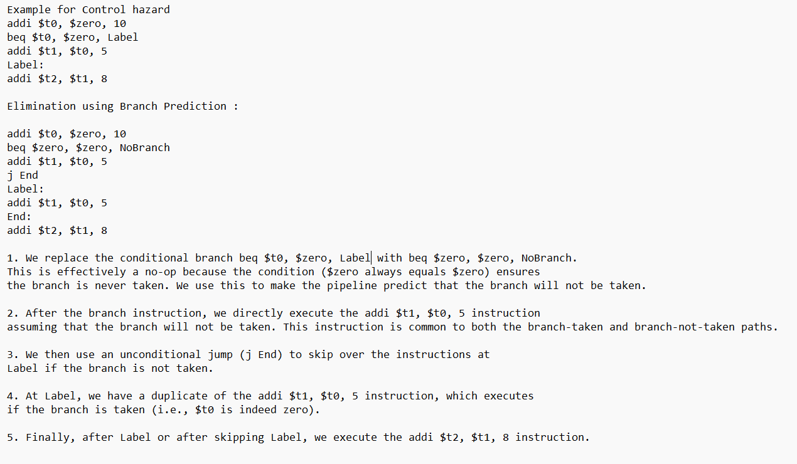

**Concepts Of Pipelining**

**Pipelining :**

- Pipelining is when we don't just do one thing at a time, but we do
  many things at once.

- It's like having an assembly line for instructions.

- Each step in the line is called a stage.

- We can process multiple instructions at the same time, as long as they
  are at different stages.

- Pipelining helps us get things done faster, but it doesn't make each
  instruction faster.

- The more stages we have, the faster we can get things done, as long as
  we have a lot of instructions to work with.

**Pipelining stages :**

- IF – Instruction Fetch.

- ID – Instruction Decode.

- EX – Execution or Address Calculation.

- Mem – Data Memory Access.

- WB – Write Back.

> 1\. First, during the **IF stage,** the computer grabs the instruction
> from the instruction cache and moves the program counter ahead.
>
> 2\. Next, in the **ID stage**, the computer figures out the
> instruction, reads the source registers from the register file,
> extends the immediate value, calculates the branch target address, and
> checks if the branch should be taken.
>
> 3\. Then, in the **EX stage**, the computer calculates the memory
> access addresses and does math or logic operations on two register
> values or a register and an immediate value.
>
> 4\. After that, in the **MEM stag**e, the computer either loads a
> value from the data cache or stores a value into it.
>
> 5\. Lastly, during the **WB stage,** the computer updates the register
> file with the result of an operation or a load.

**Pipeline Conflicts :**

The pipeline is subject to certain factors that cause it to deviate from
normal operation.

- **Timing Variations** :

<!-- -->

- Different stages have different time.

- In particular, In the area of instruction processing where various
  instructions have different operand requirements and therefore need to
  be processed at different time, this issues arises.

<!-- -->

- **Data hazards** :

<!-- -->

- If multiple instruction are partially executed and reference the same
  data , problems can arise.

- It is crucial to ensure that the next instruction doesn’t try to
  access data before the current one avoid incorrect results.

<!-- -->

- **Branching** :

<!-- -->

- Knowing the next instruction is essential for fetching and executing
  it.

- With the conditional branches , the next instruction may not be known
  until the current one is processed.

<!-- -->

- **Interrupts** :

<!-- -->

- Unwanted instructions can be introduced into the instruction stream by
  the interrupts , affecting the instruction execution.

<!-- -->

- **Data Dependency** :

<!-- -->

- When an instruction relies on the result of a previous one that isn’t
  available yet.

**Advantages :**

- Reduces the processor’s cycle time .

- Increases system throughput .

- Enhances system reliability.

**Disadvantages :**

- Complex and costly design of pipelined processors.

- Higher instruction latency.

**Pipelining hazards :**

A hazard is when something happens that makes the pipeline stop.

 **Structural hazards :**
>
> When hardware resources required by one instruction are unavailable
> due to another instruction in the pipeline using them, structural
> hazards occurs.
>
> **Typical reasons include:**
>
> **Resource conflicts**: These happen when two or more instructions try
> to use the same hardware resource at the same time, like a memory
> module, bus, or functional unit (like the ALU, or arithmetic logic
> unit).
>
> **Mitigation techniques:**
>
> **Resource duplication**: It is the process of adding more hardware
> components to enable the simultaneous usage of a resource by several
> instructions.
>
> **Pipeline Interlocks**: Pipeline stages are introduced to detect and
> resolve conflicts dynamically. This can be done by inserting stall
> cycles or using bypass paths to avoid resource contention.

**Data Hazards :**

> Data hazards occur when there are dependencies between instructions,
> especially when subsequent instructions rely on the results of earlier
> ones. There are three main types of data hazards:
>
> **Read After Write (RAW)**: This happens when a later instruction
> tries to read data before a prior instruction has finished writing it.
>
> **Write After Read (WAR):** This occurs when a later instruction tries
> to write data before a prior instruction has finished reading it.
>
> **Write After Write (WAW):** This happens when two instructions try to
> write to the same location in a register or memory without any
> intervening read.
>
> **Mitigation techniques :**
>
> **Data Forwarding (Bypassing):** This involves transmitting data
> directly from the output of one pipeline stage to the input of another
> to prevent stalls caused by data hazards.
>
> **Register Renaming:** This involves reassigning logical registers to
> physical registers in order to break dependencies and enable
> out-of-order execution.

**Control Hazards :**
>
>- Control hazards happen when the program's flow changes, like with
  branches or jumps.

>- They can mess up the order of instructions.

>- One common issue is when the processor has to wait for the branch
  target address to be calculated during a branch instruction.

>**Mitigation technique :**

>- **Branch Prediction:** Guessing if a branch will be taken or not
before it's confirmed, so the pipeline can keep going without
stopping.

>- **Speculative Execution:** Running instructions based on branch
predictions to lessen the effect of wrong guesses on the
pipeline's speed.

